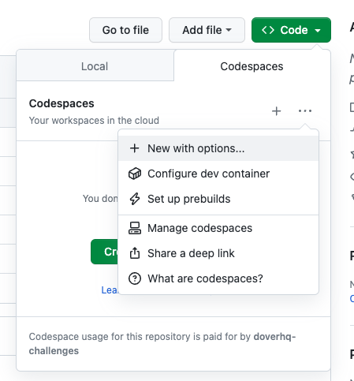
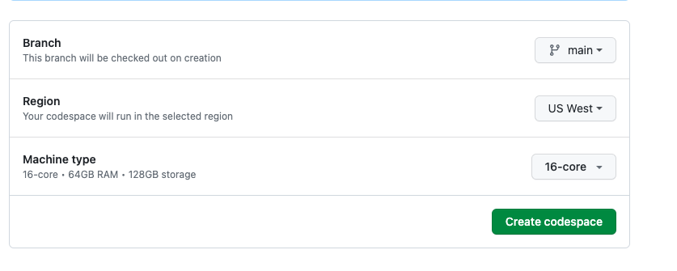
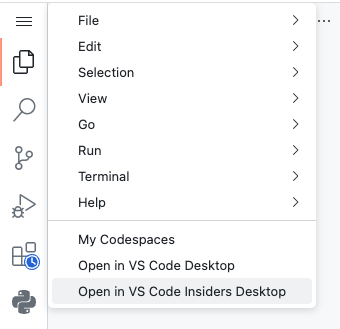

# Codespaces Test
This is a test repository to get familiar with Github Codespaces.

## For Interviewees

1. You will be given a repository link from your interviewer. From here you want to setup your codespace.

    In the Github repo, click on the green dropdown `Code > Codespaces > ... > New with options...`

    

    Up the machine type to the best one `16-core`
   
    

    The codespace may take ~ 10 minutes to load.

    If the codespace fails to load, you may just want to remove the trailing `?editor=jupyter` from the browser URL.

    Once loaded, take some time to make some files and play around with the codespace. 
   

3. **Recommended**: If you prefer to (and already have vscode installed) work on vscode desktop, you can do so by pressing the `Top left menu > Open in VS Code Desktop`
   
    

    It will prompt you to login and auth your github account, but everything should be ok as long as you follow the directions. It may seem as you get prompted over and over again and that there is a bug. Just keep hitting `Yes` until a step where you have to paste in a 2FA code and it should work finally. From there you'll be able to access everything else just you can in the code browser.
